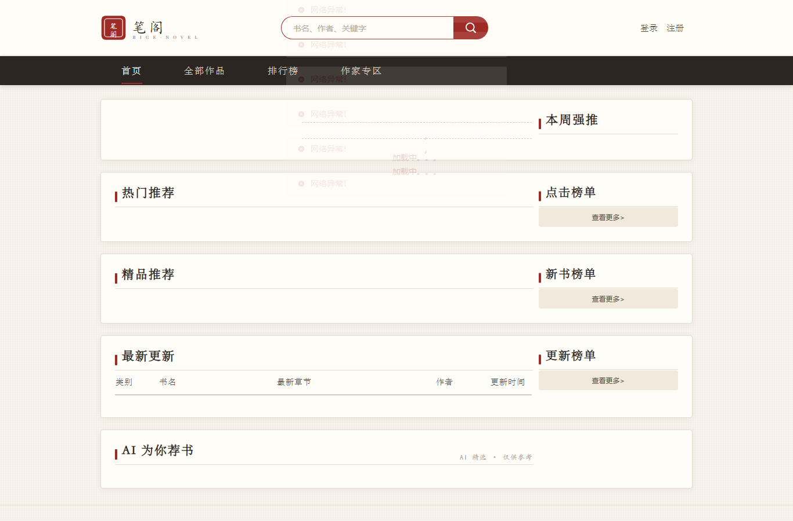
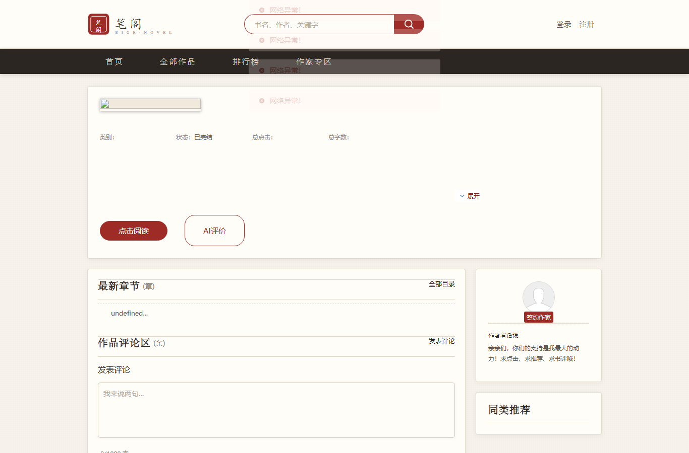
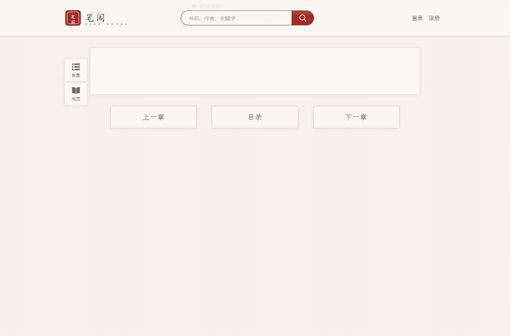
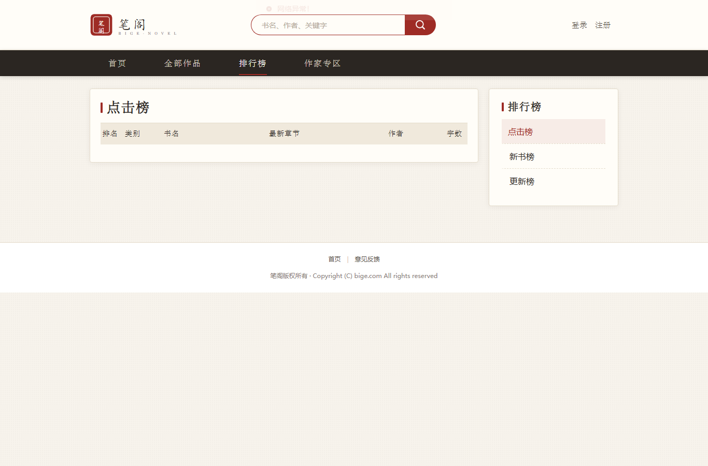

<p align="center">
  <h1 align="center">笔阁 — 新中式小说门户</h1>
  <p align="center">Spring Boot 3 + Vue 3 前后端分离 · 集成 AI 能力 · 新中式国风 UI</p>
</p>

<p align="center">
  
  
  
  
  
  
</p>

---

## 项目简介

一套**前后端分离**的网络小说系统「笔阁」，基于 Spring Boot 3 + Vue 3 构建，采用**新中式国风设计**(印章 logo、朱砂色板、宣纸质感)，涵盖小说推荐、排行榜、阅读、评论、作家专区等功能，并深度集成 **Spring AI** 实现智能书评、章节导读、AI 荐书等能力。

> 原项目 [novel](https://github.com/201206030/novel) 为学习型项目，本仓库在其基础之上：
> - 前端全站重构：新中式国风 UI(设计规范见 `designs/novel-redesign.md`)
> - 新增 **4 个 AI 门户功能**(书评/导读/评论草稿/智能荐书)
> - 规范化项目布局(monorepo + 统一 .gitignore) + Docker + CI/CD + 开发文档
> - 内置演示数据生成器(100 用户 / 3000 评论 / 新闻)

## 功能一览

| 模块 | 功能 |
|------|------|
| 门户首页 | 轮播推荐、本周强推、热门/精品推荐、分类检索、排行榜 |
| 小说详情 | 书籍信息、章节目录、同类推荐、**AI 书评** |
| 小说阅读 | 正文阅读(多主题/字体/字号)、上下章切换、**AI 章节导读** |
| 评论系统 | 发表/修改/删除评论、**AI 帮写评论草稿** |
| 用户中心 | 注册/登录(JWT)、个人信息、我的评论 |
| 作家专区 | 发布小说/章节、**AI 扩写/缩写/续写/润色** |
| 智能推荐 | 首页 **AI 为你荐书**模块(5 本精选+推荐语) |

## 截图(实际运行效果)

| 首页 | 书详情页 |
|------|----------|
|  |  |

| 阅读页 | 排行榜 |
|--------|--------|
|  |  |

## 技术栈

| 层级 | 技术 | 版本 |
|------|------|------|
| 后端框架 | Spring Boot | 3.3.0 |
| AI 框架 | Spring AI (OpenAI → SiliconFlow) | 1.0.0 |
| ORM | MyBatis-Plus | 3.5.6 |
| 数据库 | MySQL | 8.0 |
| 缓存 | Caffeine + Redis 双缓存 | Caffeine 3.1 / Redis 7 |
| 搜索引擎 | Elasticsearch | 8.2(可选) |
| 消息队列 | RabbitMQ | 3.10(可选) |
| 认证 | JJWT (JWT) | 0.11.5 |
| 接口文档 | SpringDoc OpenAPI 3 | 2.5.0 |
| 前端框架 | Vue 3 + Element Plus | 3.2 / 2.2 |
| 构建 | Maven / Vue CLI | 3.8 / 5.0 |

## 快速启动

### 方式一:Docker(推荐)

```bash
# 1. 克隆项目
git clone https://github.com/hanhaiguzhou/springboot-novel.git
cd springboot-novel

# 2. 配置环境变量(可选,AI 功能需要)
cp .env.example .env
# 编辑 .env 填入 SiliconFlow API Key

# 3. 一键启动 MySQL + Redis
docker-compose up -d mysql redis

# 4. 启动后端(另一个终端)
cd backend
# 先执行数据库建表脚本
# mysql -h 127.0.0.1 -uroot -p123456 < doc/sql/novel_struc.sql
.\mvnw.cmd spring-boot:run

# 5. 启动前端(另一个终端)
cd frontend
npm install
npm run serve
```

打开 http://localhost:1024 访问门户,http://localhost:8888/swagger-ui.html 查看接口文档。

### 方式二:手动安装

需求:JDK 21、Maven 3.8、Node 16+、MySQL 8.0、Redis 7

```bash
# 数据库
mysql -uroot -p < backend/doc/sql/novel_struc.sql

# (可选) 生成演示数据:100 用户 + 3000 条评论 + 新闻(用户密码均为 123456)
mysql --default-character-set=utf8mb4 -uroot -p123456 novel < backend/doc/script/generate_mock_data.sql

# 后端
cd backend && .\mvnw.cmd spring-boot:run

# 前端
cd frontend && npm install && npm run serve
```

## 项目架构

```
┌────────────────────────────────────────────┐
│  前端 Vue 3 (Element Plus)                  │
│  axios → /api/front/*  /api/author/*       │
└──────────────────┬─────────────────────────┘
                   │ HTTP JSON
┌──────────────────▼─────────────────────────┐
│  后端 Spring Boot 3                         │
│                                             │
│  Interceptor(Auth) → Controller            │
│       ↓                                    │
│  Service → Manager → Dao                   │
│       ↓              ↓                     │
│  Caffeine Cache   Redis Cache              │
│       ↓                                    │
│  MySQL 8.0                                 │
│                                             │
│  Spring AI ────▶ SiliconFlow (DeepSeek)     │
└────────────────────────────────────────────┘
```

**分层说明:**
- `controller` — 接入层,只做参数校验和调用 Service,不写业务逻辑
- `service` — 业务编排,把活派给 Manager
- `manager` — 通用能力下沉:缓存读写、消息发送、多 DAO 组合、第三方 API 封装
- `dao` — 数据访问,MyBatis-Plus Mapper
- `core` — 切面(AOP)、认证(策略模式)、拦截器、限流、工具

## AI 能力详解

| 功能 | 接口 | 模型 | 场景 |
|------|------|------|------|
| AI 书评 | `/api/front/ai/book_review` | DeepSeek R1 | 结构化输出评分/亮点/槽点/适合人群,JSON 解析失败自动降级 |
| AI 章节导读 | `/api/front/ai/chapter_summary` | DeepSeek R1 | 取章节前 1500 字→要点+伏笔+体验点评 |
| AI 评论草稿 | `/api/front/ai/comment_draft` | DeepSeek R1 | 结合书简介+用户草稿→补全润色成 50-120 字书评 |
| AI 智能荐书 | `/api/front/ai/recommend` | DeepSeek R1 | 从点击榜+新书榜选 5 本,每本配推荐语,解析失败降级热门榜 |
| AI 扩写/缩写/续写/润色 | `/api/author/ai/*` | DeepSeek R1 | 作家后台写作辅助(已有) |

**技术亮点:**
- Spring AI ChatClient 统一抽象,换模型只需改 yaml 配置
- `extractJson()` 兼容 R1 推理模型输出(非严格 JSON)
- Caffeine 本地限流保护调用成本(1 分钟窗口)
- 前端打字效果逐字渲染 AI 生成内容(ChapterAdd.vue)

## 目录结构

```
springboot-novel/
├── backend/                          # 后端 Spring Boot
│   ├── src/main/java/.../novel/      # 源码(controller/service/manager/dao)
│   ├── src/main/resources/           # 配置/MyBatis XML
│   ├── doc/sql/                      # 数据库脚本
│   ├── Dockerfile                    # 容器化构建
│   └── pom.xml
├── frontend/                         # 前端 Vue 3
│   └── src/                          # 组件/路由/API 层
├── docs/                             # 文档
│   └── DEVELOPMENT.md               # 开发指南(架构详解/缓存策略/AI 实现)
├── .github/workflows/                # CI 流水线
├── docker-compose.yml                # 一键启动依赖服务
└── .env.example                      # 环境变量模板
```

## 文档

- [开发指南](docs/DEVELOPMENT.md) — 架构全链路追踪、缓存体系、认证流程、AI 深度解析、如何加功能、FAQ
- 接口文档 — 启动后端后访问 http://localhost:8888/swagger-ui.html

## License

Apache 2.0 — 原项目 [201206030/novel](https://github.com/201206030/novel) 的子项目
